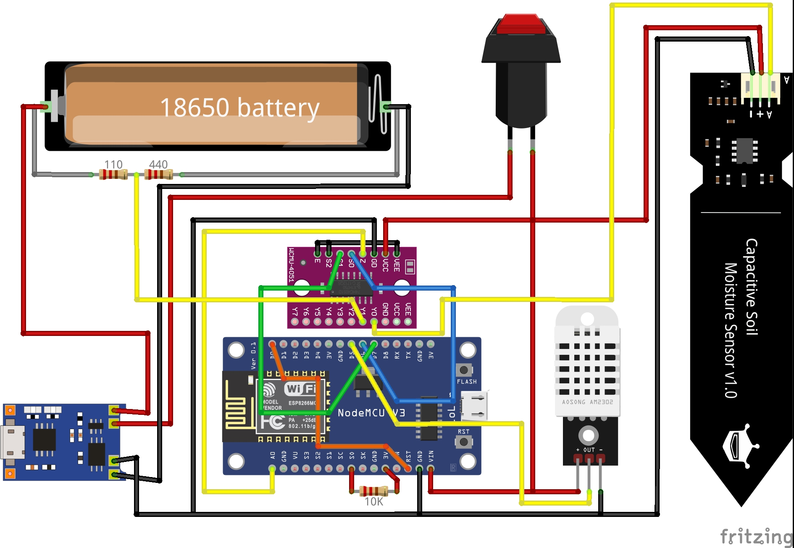

# 🌱 ESP8266 Plant Monitor with MQTT & Deep Sleep

Battery-powered plant monitoring system using NodeMCU (ESP8266), designed to send data to [Home Assistant](https://www.home-assistant.io/) via MQTT.

It reads:
- 🌡️ Temperature and 💧 Humidity (DHT22)
- 🌱 Soil Moisture (via capacitive sensor + 74HC4051 multiplexer)
- 🔋 Battery Level (%) (via voltage divider + 74HC4051 multiplexer)

Data is published to MQTT, then the ESP enters **deep sleep** for 2 hours to save power.

---

## 🔧 Hardware Overview

- ESP8266 NodeMCU
- DHT22 Sensor
- Capacitive Soil Moisture Sensor
- 74HC4051 Analog Multiplexer
- TP4056 Li-ion charger
- 18650 Battery
- Voltage Divider (110Ω + 440Ω) for safe battery reading
- 10kΩ pull-up resistor on SD0 to avoid flash mode on boot
- Direct connection between GPIO16 (D0) and RST for wake-up from deep sleep
- Switch inline between battery and circuit (used to power on/off)
- MQTT broker + Home Assistant

> Moisture and battery readings are taken via MUX channels connected to A0.

---

## 🖼️ Wiring Diagram

---

## 📡 MQTT Topics

Topic | Type | Description
---|---|---
`home/plants/1/moisture` | Integer (raw) | Soil moisture
`home/plants/1/battery`  | Integer (%) | Battery level
`home/plants/1/humidity` | Float (%) | Air humidity (DHT22)
`home/plants/1/temperature` | Float (°C) | Air temperature (DHT22)

---

## 💤 Deep Sleep Behavior

- Sleeps for 2 hours after successful MQTT publish
- If Wi-Fi or MQTT fails, retries in 30 minutes
- Wake is triggered via GPIO16 (D0) connected to RST

---

## ⚠️ Notes

- Ensure voltage from battery is scaled safely for A0 (1V max)
- Can be extended to support multiple plants via MUX channels

---

## 🛠️ To-Do

- [x] Add battery percent level
- [x] Add humidity and temperature sensor (DHT)
- [ ] Add battery charging status

---

## 📜 License

MIT License
